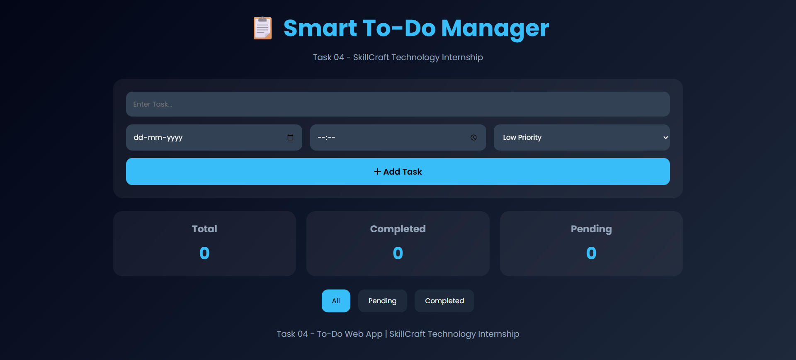
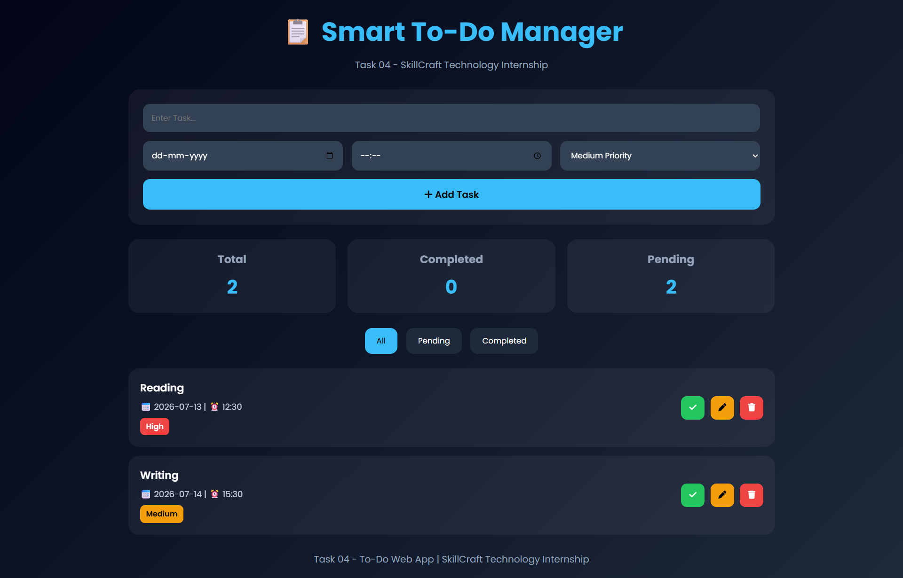
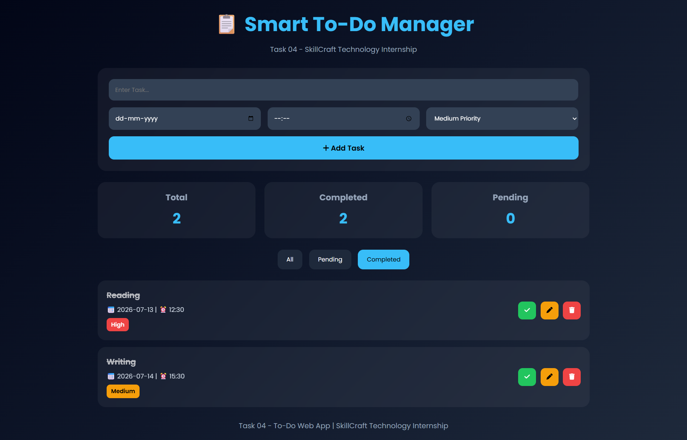

# 📋 Smart To-Do Manager

## 📌 Task 04 - SkillCraft Technology Internship

This project was developed as part of the **SkillCraft Technology Web Development Internship Program**.

The objective of this task was to create a fully functional To-Do Web Application that allows users to efficiently manage their daily tasks with features such as task creation, editing, completion tracking, priority management, date & time scheduling, and local storage persistence.

---

## 🚀 Live Demo

```text
https://koayush1310.github.io/SCT_WD_4/
```

---

## 📂 GitHub Repository

```text
https://github.com/koayush1310/SCT_WD_4
```

---

## ✨ Features

### 📝 Task Management

- Add New Tasks
- Edit Existing Tasks
- Delete Tasks
- Mark Tasks as Completed
- Undo Completed Tasks

### 📅 Scheduling

- Set Due Date
- Set Due Time
- Organize Tasks Efficiently

### 🚦 Priority Levels

- 🟢 Low Priority
- 🟡 Medium Priority
- 🔴 High Priority

### 📊 Dashboard

- Total Tasks Counter
- Completed Tasks Counter
- Pending Tasks Counter

### 🔍 Filtering

- View All Tasks
- View Pending Tasks
- View Completed Tasks

### 💾 Data Persistence

- Local Storage Integration
- Tasks remain saved after page refresh
- Automatic data loading

### 🎨 User Interface

- Modern Glassmorphism Design
- Responsive Layout
- Smooth Animations
- Mobile-Friendly Interface

---

## 🛠️ Technologies Used

- HTML5
- CSS3
- JavaScript (Vanilla JS)
- Local Storage API
- Font Awesome Icons
- Google Fonts (Poppins)

---

## 📁 Project Structure

```text
SCT_WD_4/
│
├── index.html
├── style.css
├── script.js
├── README.md
└── screenshots/
```

---

## 🖼️ Screenshots

### Home Page



### Task Added



### Completed Tasks



---

## ▶️ How to Run

### Clone Repository

```bash
git clone https://github.com/koayush1310/SCT_WD_4.git
```

### Open Project

```bash
cd SCT_WD_4
```

### Run

Open `index.html` in your browser.

---

## 🎯 Learning Outcomes

Through this project, I gained practical experience in:

- DOM Manipulation
- Event Handling
- CRUD Operations
- Local Storage Management
- Dynamic UI Updates
- JavaScript Arrays & Objects
- Responsive Web Design
- Frontend Development Best Practices

---

## 📋 Task Requirements Covered

✅ Add Tasks

✅ Edit Tasks

✅ Delete Tasks

✅ Mark Tasks as Completed

✅ Set Date & Time

✅ Organize Tasks

✅ Task Filtering

✅ Local Storage Persistence

✅ Responsive Design

✅ Modern User Interface

---

## 👨‍💻 Author

**Ayush Konchada**

Web Development Intern

SkillCraft Technology

GitHub:
https://github.com/koayush1310

LinkedIn:
Add Your LinkedIn Profile Link Here

---

## 📜 License

This project was developed for educational and internship purposes.

---

## 🙏 Acknowledgement

Special thanks to **SkillCraft Technology** for providing this opportunity to enhance my web development skills through practical project-based learning.